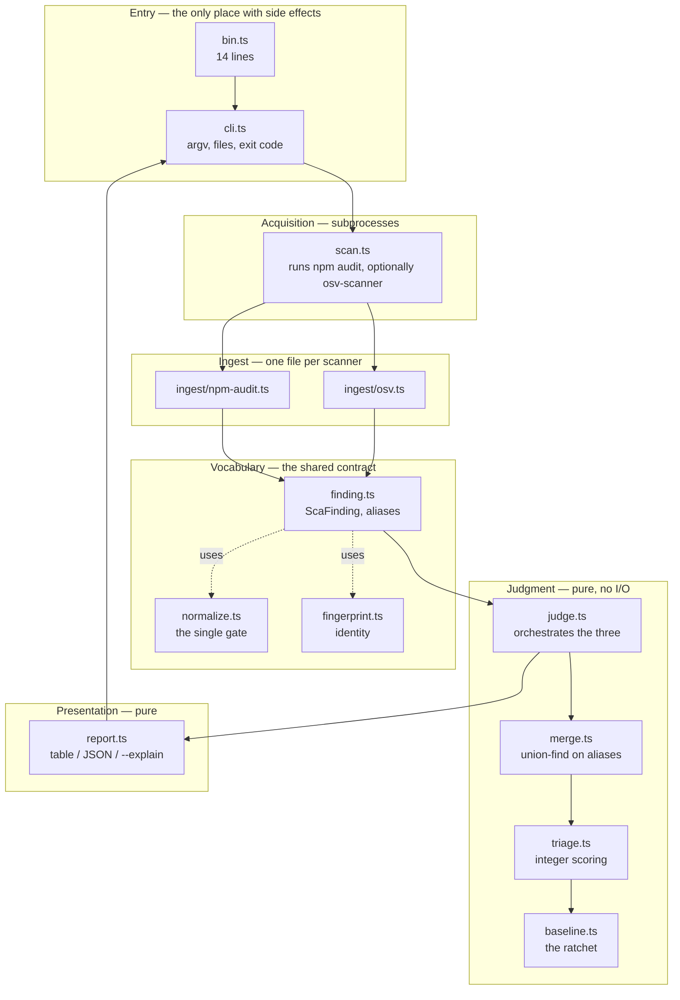

# Architecture

How `npx zero-shelter judge` is put together, and where to add things.

The shape is deliberately boring: data moves in one direction through five
layers, and only the outermost one touches the world. That is what makes it
possible for several people to work on different layers at once without
stepping on each other.

## Layers



**Only `bin.ts`, `cli.ts` and `scan.ts` touch the outside world.** Everything
else is a function from data to data. That is not architectural taste — it is
what lets the tests drive the entire judgement path from fixtures without ever
spawning a scanner, so a test failure means the logic is wrong rather than that
someone's machine lacks a binary.

## One run, end to end

```mermaid
sequenceDiagram
    autonumber
    actor dev as Developer
    participant cli as cli.ts
    participant scan as scan.ts
    participant ing as ingest/*
    participant judge as judge.ts
    participant merge as merge.ts
    participant triage as triage.ts
    participant base as baseline.ts
    participant rep as report.ts

    dev->>cli: npx zero-shelter judge
    cli->>cli: parseArgs
    cli->>base: read .zero-shelter/baseline.json
    note over cli,base: missing is a normal first run;<br/>malformed is a hard error

    cli->>scan: collect({ cwd })
    scan->>scan: npm audit --json
    note over scan: exits non-zero when it finds<br/>things — that is success
    scan->>scan: osv-scanner (skipped if absent)
    scan->>ing: parseNpmAudit / parseOsv
    ing-->>scan: ScaFinding[]
    scan-->>cli: findings + skipped notes

    cli->>judge: judge(findings, { baseline })
    judge->>merge: mergeFindings
    note over merge: join on shared aliases;<br/>flag, never guess
    merge-->>judge: MergedFinding[]
    judge->>triage: rank
    note over triage: integers only
    triage-->>judge: RankedFinding[]
    judge->>base: applyBaseline
    base-->>judge: fresh / suppressed
    judge-->>cli: JudgeResult

    cli->>rep: renderHuman | renderJson | renderExplain
    rep-->>cli: string
    cli-->>dev: output + exit 1 if anything is new
```

## The data, as it changes shape

Five types, each produced by exactly one layer:

| Type | Produced by | What it is |
|---|---|---|
| `string` (raw JSON) | `scan.ts` | Whatever the scanner printed |
| `ScaFinding` | `ingest/*` | One advisory, one source, normalized |
| `MergedFinding` | `merge.ts` | One advisory, all sources that saw it |
| `RankedFinding` | `triage.ts` | A merged finding plus its score and reasons |
| `JudgeResult` | `judge.ts` | Everything the report needs, and nothing more |

Adding a field means deciding which layer owns it. If no layer can fill it, it
does not go in — we removed `devOnly` for exactly that reason.

## Rules per layer

These are what reviews check.

**Ingest** — every string passes through `normalize.ts`. Never build a
fingerprint by hand; call `fingerprint()`. Preserve `aliases` even when they
look redundant, because that is the only thing the merge can join on. Secrets
are hashed at parse time and the original is dropped.

**Judgment** — no I/O, no `Date`, no randomness. Integer arithmetic only:
floating point rounds differently per platform, and a ranking that moves by host
makes every number we publish true only on the machine that produced it. Output
must not depend on input order — every stage sorts by fingerprint, and there are
tests that reverse the input and compare.

**Presentation** — reads, never computes. If the table shows something the JSON
cannot, that is a bug: they are three views of one dataset, not three datasets.

**Entry / acquisition** — the only place allowed to fail because of the
environment. A missing optional scanner is a note, not an error.

## Where to add things

```
새 스캐너를 붙이려면        → src/ingest/<tool>.ts + scan.ts에 한 줄
판정 품질을 고치려면        → src/merge.ts, src/triage.ts
출력을 바꾸려면             → src/report.ts
새 명령을 추가하려면        → src/cli.ts
```

A new scanner is the most self-contained kind of change: one new file, one line
in `scan.ts`, one fixture, one snapshot. It touches nothing anyone else is
editing.

## npm CLI packaging

The parts specific to shipping this as a CLI, since they are easy to get subtly
wrong:

```jsonc
{
  "type": "module",           // ESM. imports must carry the .js extension,
                              // even in .ts sources — TypeScript does not add it
  "bin": {
    "zero-shelter": "./dist/bin.js"   // what npx resolves
  },
  "files": ["dist"],          // only built output is published
  "engines": { "node": ">=20" }
}
```

- `bin.ts` exists solely so `cli.ts` can be imported by tests without running.
  A module that executes on import cannot be tested.
- `dist/` is built by `npm run build` and is not committed. `npx zero-shelter`
  runs the published build, so **anything outside `files` does not exist** to a
  user.
- `bin.js` needs its `#!/usr/bin/env node` line. TypeScript preserves it because
  it is the first line of `bin.ts`.
- Nothing is published yet. The first publish is a human decision — see the
  release checklist when we write one.

## What is not covered by tests

Said plainly so nobody mistakes a green CI for more than it is.

**`scan.ts` has no tests.** CI passing on Windows means the 68 tests pass there;
it does not mean `npm.cmd` resolution, non-zero exit handling, or the ENOENT
path have ever run on Windows. Those are the least verified lines in the
project.

Fixing that means making the subprocess call injectable so the failure modes can
be driven without a real scanner.
