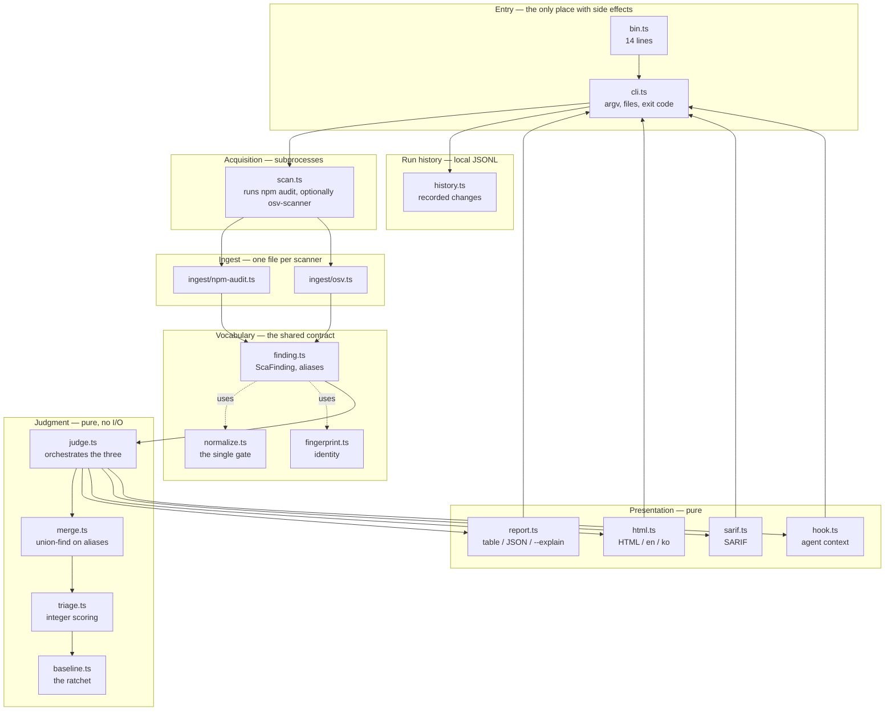

# Architecture

How `npx zero-shelter judge` is put together, and where to add things.

The shape is deliberately boring: judgement data moves in one direction
through five core layers, while the CLI adds history and presentation adapters
around the result. That is what makes it possible for several people to work
on different layers at once without stepping on each other.

A small package-manager adapter keeps remediation commands in the same
dialect as the project's lockfile.

## Layers



**Project I/O and subprocesses stay at the boundary.** `cli.ts` owns files,
stdin, stdout, and exit codes; `scan.ts` owns scanner subprocesses; and
`version.ts` reads only the installed package metadata. The judgement,
normalization, history model, and presentation modules remain data-to-data
functions. That is not architectural taste — it is what lets the tests drive
the judgement path from fixtures without ever spawning a scanner, so a test
failure means the logic is wrong rather than that someone's machine lacks a
binary.

The package-manager adapter is also data-to-data: it selects the install
command, override key, and whether a `clears N` promise is supported from the
detected lockfile.

## One run, end to end

```mermaid
sequenceDiagram
    autonumber
    actor dev as Developer
    participant cli as cli.ts
    participant scan as scan.ts
    participant ing as ingest/*
    participant judge as judge.ts
    participant merge as merge.ts
    participant triage as triage.ts
    participant base as baseline.ts
    participant rep as report.ts

    dev->>cli: npx zero-shelter judge
    cli->>cli: parseArgs
    cli->>base: read .zero-shelter/baseline.json
    note over cli,base: missing is a normal first run;<br/>malformed is a hard error

    cli->>scan: collect({ cwd })
    scan->>scan: npm audit --json
    note over scan: exits non-zero when it finds<br/>things — that is success
    scan->>scan: osv-scanner (skipped if absent)
    scan->>ing: parseNpmAudit / parseOsv
    ing-->>scan: ScaFinding[]
    scan-->>cli: findings + skipped notes

    cli->>judge: judge(findings, { baseline })
    judge->>merge: mergeFindings
    note over merge: join on shared aliases;<br/>flag, never guess
    merge-->>judge: MergedFinding[]
    judge->>triage: rank
    note over triage: integers only
    triage-->>judge: RankedFinding[]
    judge->>base: applyBaseline
    base-->>judge: fresh / suppressed
    judge-->>cli: JudgeResult

    alt judge
        cli->>rep: renderHuman | renderJson | renderHtml | renderSarif
        rep-->>cli: string
        opt --record
            cli->>cli: append .zero-shelter/history.jsonl
        end
        cli-->>dev: output + exit 1 if anything is new
    else hook
        cli->>rep: hookContext + hookOutput
        rep-->>dev: context or quiet exit 0
    end
```

## The data, as it changes shape

Core types, each produced by exactly one layer:

| Type | Produced by | What it is |
|---|---|---|
| `string` (raw JSON) | `scan.ts` | Whatever the scanner printed |
| `ScaFinding` | `ingest/*` | One advisory, one source, normalized |
| `MergedFinding` | `merge.ts` | One advisory, all sources that saw it |
| `RankedFinding` | `triage.ts` | A merged finding plus its score and reasons |
| `JudgeResult` | `judge.ts` | Everything the report needs, and nothing more |
| `Change` | `history.ts` | The difference between recorded runs |

Adding a field means deciding which layer owns it. If no layer can fill it, it
does not go in — we removed `devOnly` for exactly that reason.

## Rules per layer

These are what reviews check.

**Ingest** — every string passes through `normalize.ts`. Never build a
fingerprint by hand; call `fingerprint()`. Preserve `aliases` even when they
look redundant, because that is the only thing the merge can join on. Secrets
are hashed at parse time and the original is dropped.

**Judgment** — no I/O, no `Date`, no randomness. Integer arithmetic only:
floating point rounds differently per platform, and a ranking that moves by host
makes every number we publish true only on the machine that produced it. Output
must not depend on input order — every stage sorts by fingerprint, and there are
tests that reverse the input and compare.

**Presentation** — reads, never computes. If one view shows something the JSON
cannot, that is a bug: text, JSON, SARIF, HTML, and hook context are views of
one judgement, not separate datasets.

**Entry / acquisition** — the only place allowed to fail because of the
environment. A missing optional scanner is a note, not an error.

**Package manager** — `package-manager.ts` translates one remediation into the
project's dialect: `npm i`, `pnpm add`, or `yarn add`; it also selects
`overrides`, `pnpm.overrides`, or `resolutions`. Only npm has the lockfile
range reader needed to promise a `clears N` count.

## Where to add things

```
to add a scanner        → src/ingest/<tool>.ts, then wire both entry points:
                          one line in scan.ts (runs it) and one branch in
                          readInput in cli.ts (reads its saved output)
to change what we judge → src/merge.ts, src/triage.ts
to change what we print → src/report.ts, src/html.ts, src/sarif.ts
to change the history   → src/history.ts, src/cli.ts
to add a command        → src/cli.ts
to change remediation dialect → src/package-manager.ts, src/actions.ts,
                              src/report.ts, src/hook.ts

Two callers build a judgement: `judge` and `hook`, and they assemble the
options separately. Every field added to `JudgeOptions` has to be wired into
both, and the hook has been left behind three times — the lockfile it was not
reading, the package manager dialect, and the withheld `clears` count. It is
the worst place to be wrong, because a person would notice `npm i` in a pnpm
repository and an agent just runs it. `npm run qa:agent` covers the hook per
manager for that reason.
```

A new scanner is fairly self-contained, but **there are two entry points and
missing the second one is the usual mistake.** `scan.ts` runs scanners as
subprocesses. `--input` reads a report someone already produced, and it
dispatches separately in `readInput` (`src/cli.ts`) by probing the shape of the
JSON:

```ts
if ("vulnerabilities" in record || "advisories" in record) return parseNpmAudit(raw);
if ("results" in record) return parseOsv(raw);
```

A parser wired only into `scan.ts` is unreachable from `--input`, which is the
path CI and offline users take. `readInput`'s error message also names the
shapes it knows, so a third one means that message is wrong until it is updated.

So: one new file, one line in `scan.ts`, one branch and one message in
`cli.ts`, one fixture, one snapshot.

The hand-maintained `if` chain is the thing that makes this doc easy to get
wrong — each ingest module could export its own `detect`, and the dispatch could
iterate. That would make this section true instead of merely accurate. It is
open as a design question rather than done.

## npm CLI packaging

The parts specific to shipping this as a CLI, since they are easy to get subtly
wrong:

```jsonc
{
  "type": "module",           // ESM. imports must carry the .js extension,
                              // even in .ts sources — TypeScript does not add it
  "bin": {
    "zero-shelter": "./dist/bin.js"   // what npx resolves
  },
  "files": ["dist"],          // only built output is published
  "engines": { "node": ">=20" }
}
```

- `bin.ts` exists solely so `cli.ts` can be imported by tests without running.
  A module that executes on import cannot be tested.
- `dist/` is built by `npm run build` and is not committed. `npx zero-shelter`
  runs the published build, so **anything outside `files` does not exist** to a
  user.
- `bin.js` needs its `#!/usr/bin/env node` line. TypeScript preserves it because
  it is the first line of `bin.ts`.
- The preview package is published through the GitHub Release workflow with
  npm trusted publishing (OIDC). The current package metadata and release
  status live in [`package.json`](../package.json) and the [npm package](https://www.npmjs.com/package/zero-shelter).

## What is not covered by tests

Said plainly so nobody mistakes a green CI for more than it is.

Scanner subprocess failure modes are driven through the injectable `Capture`
boundary in `scan.ts`, and package/install behavior is checked by
`npm run qa` against the packed artifact on Linux and Windows. The CI suite
also runs the unit tests on Ubuntu, macOS, and Windows; test counts are evidence
from a run, not a permanent architecture contract.
