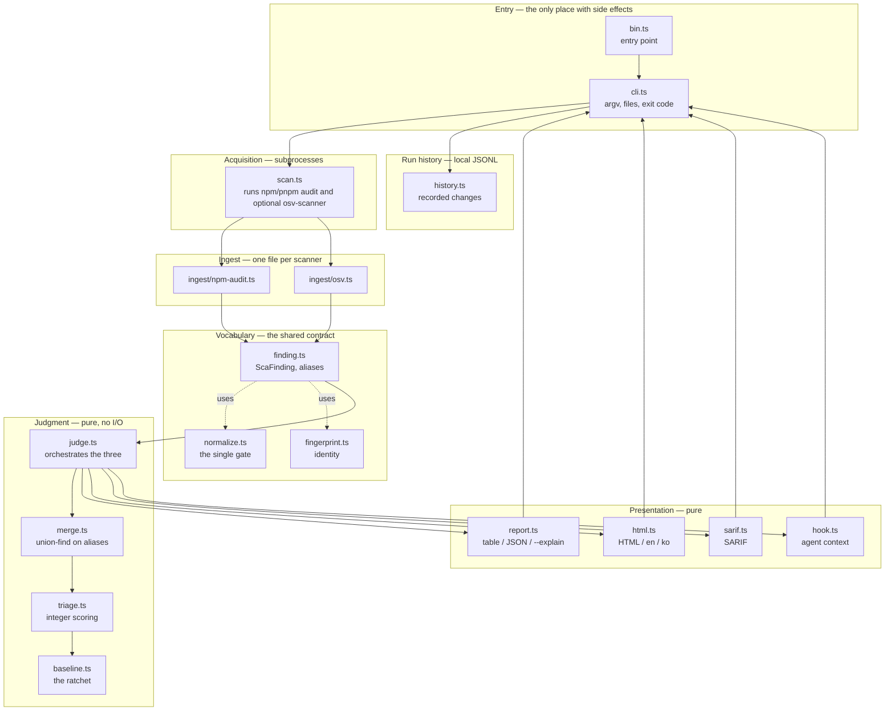

# Architecture

How `npx zero-shelter judge` is put together, and where to add things.

Judgement data moves through five core layers. The CLI adds history and presentation adapters around the result, and a package-manager adapter selects remediation commands from the project's lockfile.

## Layers



Project I/O and subprocesses stay at the boundary. `cli.ts` owns files,
stdin, stdout, and exit codes; `scan.ts` owns scanner subprocesses; and
`version.ts` reads only the installed package metadata. The judgement,
normalization, history model, and presentation modules remain data-to-data
functions. This lets tests exercise judgement with fixtures independently of installed scanners.

The package-manager adapter is also data-to-data: it selects the install
command, override key, and whether a `clears N` promise is supported from the
detected lockfile.

## One run, end to end

```mermaid
sequenceDiagram
    autonumber
    actor dev as Developer
    participant cli as cli.ts
    participant scan as scan.ts
    participant ing as ingest/*
    participant judge as judge.ts
    participant merge as merge.ts
    participant triage as triage.ts
    participant base as baseline.ts
    participant rep as report.ts

    dev->>cli: npx zero-shelter judge
    cli->>cli: parseArgs
    cli->>base: read .zero-shelter/baseline.json
    note over cli,base: missing is a normal first run;<br/>malformed is a hard error

    cli->>scan: collect({ cwd })
    scan->>scan: npm or pnpm audit --json
    note over scan: exits non-zero when it finds<br/>findings; parse the report
    scan->>scan: osv-scanner (skipped if absent)
    scan->>ing: parseNpmAudit / parseOsv
    ing-->>scan: ScaFinding[]
    scan-->>cli: findings + skipped notes

    cli->>judge: judge(findings, { baseline })
    judge->>merge: mergeFindings
    note over merge: join on shared aliases;<br/>flag, never guess
    merge-->>judge: MergedFinding[]
    judge->>triage: rank
    note over triage: integers only
    triage-->>judge: RankedFinding[]
    judge->>base: applyBaseline
    base-->>judge: fresh / suppressed
    judge-->>cli: JudgeResult

    alt judge
        cli->>rep: renderHuman | renderJson | renderHtml | renderSarif
        rep-->>cli: string
        opt --record
            cli->>cli: append .zero-shelter/history.jsonl
        end
        cli-->>dev: output + exit 1 if anything is new
    else hook
        cli->>rep: hookContext + hookOutput
        rep-->>dev: context or quiet exit 0
    end
```

## The data, as it changes shape

Core types, each produced by exactly one layer:

| Type | Produced by | What it is |
|---|---|---|
| `string` (raw JSON) | `scan.ts` | Whatever the scanner printed |
| `ScaFinding` | `ingest/*` | One advisory, one source, normalized |
| `MergedFinding` | `merge.ts` | One advisory, all sources that saw it |
| `RankedFinding` | `triage.ts` | A merged finding plus its score and reasons |
| `JudgeResult` | `judge.ts` | Judgement results and report context |
| `Change` | `history.ts` | The difference between recorded runs |

Assign each new field to the layer that can supply it. `devOnly` was previously removed because no layer could populate it.

## Rules per layer

These are what reviews check.

**Ingest** — every string passes through `normalize.ts`. Never build a
fingerprint by hand; call `fingerprint()`. Preserve `aliases` even when they
look redundant, because merging relies on shared advisory identifiers. Secret scanning is outside v1; do not infer secret-handling coverage from dependency normalization.

**Judgment** — no I/O, no `Date`, no randomness. Use integer arithmetic and preserve deterministic ordering. Output must not depend on input order; tests reverse the input and compare results.

**Presentation** — reads, never computes. If one view shows something the JSON
cannot, that is a bug: text, JSON, SARIF, HTML, and hook context are views of
one judgement, not separate datasets.

**Entry / acquisition** — the only place allowed to fail because of the
environment. A missing optional scanner is a note, not an error.

**Package manager** — `package-manager.ts` translates one remediation into the
project's dialect: `npm i`, `pnpm add`, or `yarn add`; it also selects
`overrides`, `pnpm.overrides`, or `resolutions`. Only npm has the lockfile
range reader needed to promise a `clears N` count.

## Where to add things

```
to add a scanner        → src/ingest/<tool>.ts, then wire both acquisition
                          paths and the manifest context:
                          one line in scan.ts (runs it), one branch in
                          readInput in cli.ts (reads its saved output), and
                          pass declared when the source cannot say direct vs
                          transitive
to change what we judge → src/merge.ts, src/triage.ts
to change what we print → src/report.ts, src/html.ts, src/sarif.ts
to change the history   → src/history.ts, src/cli.ts
to add a command        → src/cli.ts
to change remediation dialect → src/package-manager.ts, src/actions.ts,
                              src/report.ts, src/hook.ts

```

Both `judge` and `hook` build judgements and assemble their options separately. Wire new `JudgeOptions` fields into both. Previous hook omissions involved the lockfile, package-manager commands, and the withheld `clears` count. `npm run qa:agent` checks package-manager advice in the hook.

A scanner adapter must support both acquisition paths and receive manifest context. `scan.ts` runs scanners as subprocesses.
`--input` reads a report someone already produced, and it dispatches separately
in `readInput` (`src/cli.ts`) by probing the shape of the JSON. Both paths also
pass the manifest's declared package names when the source cannot establish
direct versus transitive; missing that context silently turns declared
dependencies into override advice (see #186):

```ts
if ("vulnerabilities" in record || "advisories" in record) return parseNpmAudit(raw, declared);
if ("results" in record) return parseOsv(raw, undefined, declared);
```

A parser wired only into `scan.ts` is unreachable from `--input`, which is the
path CI and offline users take. A parser that does not receive `declared` can
also report every finding as transitive when its source lacks directness, so
the report offers an override for a package the manifest declares itself.
`readInput`'s error message also names the shapes it knows, so a third one means
that message is wrong until it is updated.

Update the parser, scanner invocation, saved-input dispatch and format error message together. Pass `declared` on both parser calls and add the fixture and regression coverage required by the spec.

Parser detection is currently maintained in `readInput`. Having ingest modules export a `detect` function remains a design proposal, not an implemented interface.

## npm CLI packaging

The package declares its CLI entry point and supported Node version:

```jsonc
{
  "type": "module",           // ESM. imports must carry the .js extension,
                              // even in .ts sources — TypeScript does not add it
  "bin": {
    "zero-shelter": "./dist/bin.js"   // what npx resolves
  },
  "files": ["dist"],          // built output, plus npm's standard metadata/docs
  "engines": { "node": ">=20" }
}
```

- `bin.ts` exists solely so `cli.ts` can be imported by tests without running.
  Tests can import the command handler without invoking the entry point.
- `dist/` is built by `npm run build` and is not committed. `npx zero-shelter`
  runs the published build. Inspect `npm pack --dry-run` for the actual files shipped.
- `bin.js` needs its `#!/usr/bin/env node` line. TypeScript preserves it because
  it is the first line of `bin.ts`.
- The preview package is published through the GitHub Release workflow with
  npm trusted publishing (OIDC). The current package metadata and release
  status live in [`package.json`](../package.json) and the [npm package](https://www.npmjs.com/package/zero-shelter).

## Test boundaries

Scanner subprocess failure modes are driven through the injectable `Capture`
boundary in `scan.ts`, and package/install behavior is checked by
`npm run qa` against the packed artifact on Linux and Windows. The CI suite
also runs the unit tests on Ubuntu, macOS, and Windows; test counts are evidence
from a run, not a permanent architecture contract.
